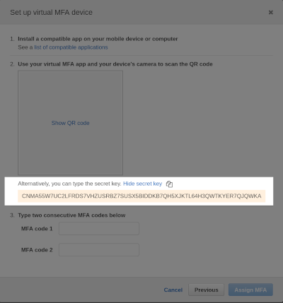

# SOTP: Sops OTP

Small utility to store AWS TOTP secrets into Sops encrypted files and generate OTP on the command line.

Usage:

```
$ sotp test1
current one-time password is: 693190
```

Sotp reads it's configuration from `config.yaml` in the local directory.
The config must be a valid Sops encrypted YAML file with the syntax:

```yaml
accounts:
    - name: test1
      totpsecret: YAGQP5IP77OO3HMPS3D2KPMSNLNDIB7EO22EGAN3JEGE3DAR37Z2U5YDGKGN44VA
    - name: test2
      totpsecret: xyzabcd....
```

* `name` is just a reference name that you'll use when invoking Sotp
* `totpsecret` is a the secret seed you get from the `Adding a virtual MFA` screen in the AWS IAM console of a given user

